# AdHoc-SQLQueries
This repository contains sample step templates used in the [blog post](https://octopus.com/blog/automated-database-deployments-adhoc-scripts) for running ad-hoc queries.

## Usage

This process will monitor a hot folder.  The hot folder can be on server or on a local drive.  The hot folder structure should be:

```
- $hotfolder$
    - Pending
    - Processed
```

Any folder in the pending folder must have a MetaData.yaml file.  The contents of the file should be the following:

```
---
DatabaseName: RandomQuotes_Dev
Server: 127.0.0.1
Environment: Dev
SubmittedBy: Bob.Walker@octopus.com
...
```

The process will:

1) Look for any new directories in the hot folder
2) Use Octo.exe to package the folder
3) Push the package to Octopus Deploy
4) Create a new release
5) Use the MetaData.yaml file to determine which environment to deploy to
6) Move the folder to a processed location so the scripts aren't run again.

I could set up a scheduled task to run on the server.  But there is no real visibility to that task.  If it starts failing I won't know that it fails until I RDP onto that server.  

Rather than go through that nightmare I set up a new project in Octopus Deploy called "AdHoc Queries Build Database Package."  It has a single step in the process, run the PowerShell script to build the database package.  Make note of the LifeCycle, it is only running on a dummy environment which I called "SpinUp."

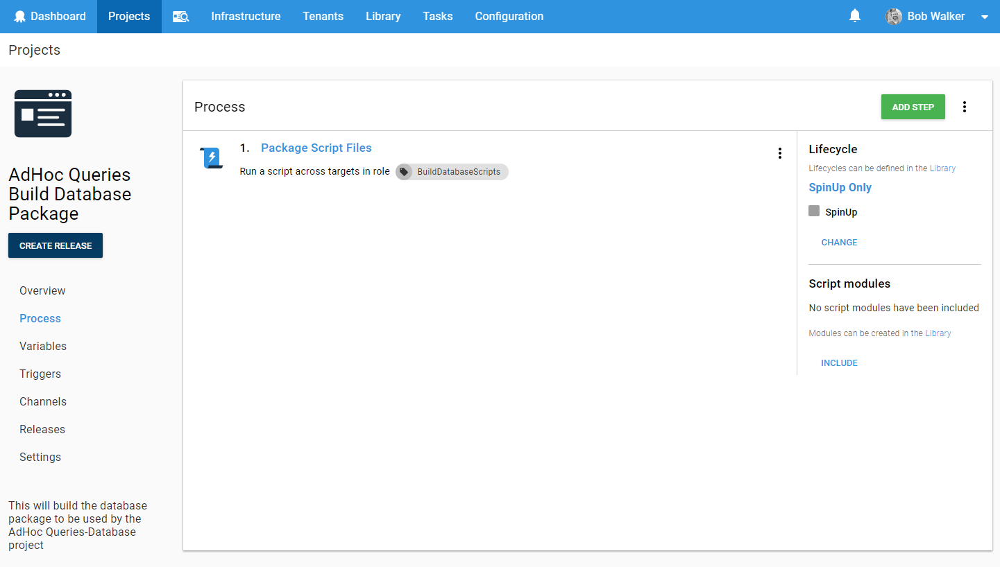

It has a trigger which will create a new release every five minutes and run this process.

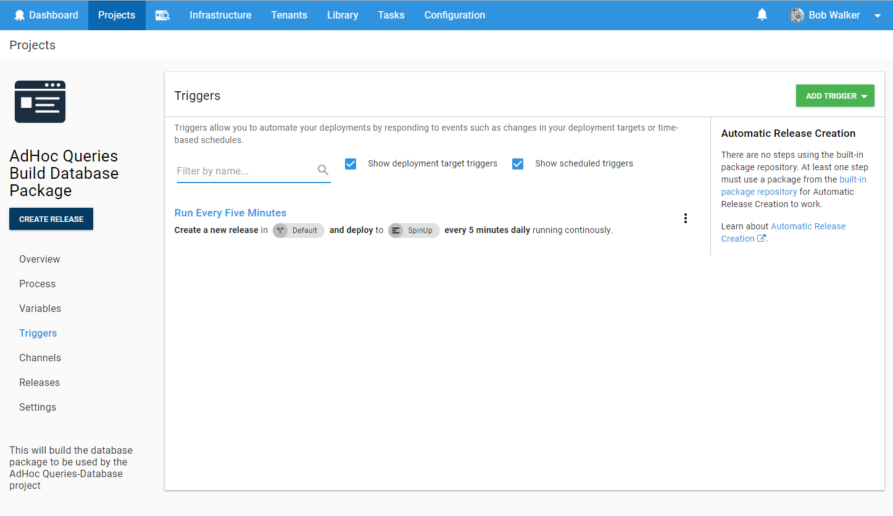

In the event, I wanted to extend this process to support other types of scripts I made it a step template.  

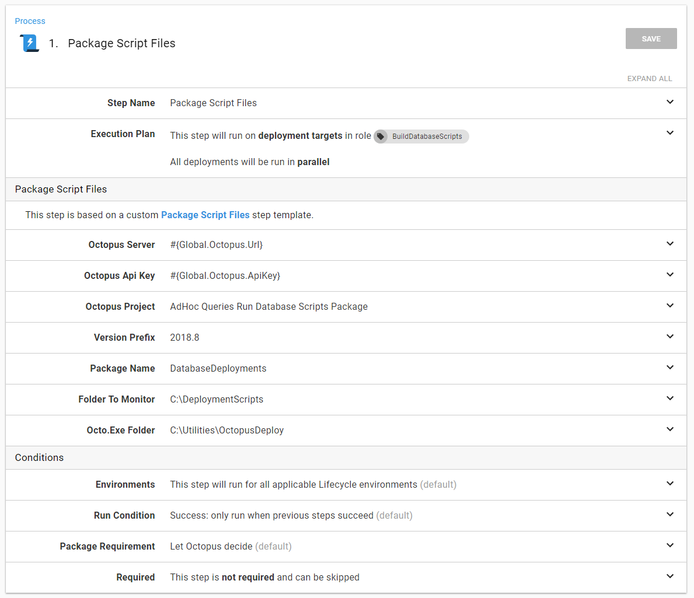

The eagle-eyed reader will see the parameter "Octopus Project."  That is the project which runs the scripts.  

## Running the Scripts

This process will do the following:

1) Download the package onto the Jump Box
2) Grab all the files in the package and add them as artifacts (in the event they need to be reviewed)
3) Perform some basic analysis on the scripts.  If any of the scripts are not using a transaction, or use the keywords "Drop" or "Delete", then I want to trigger a manual intervention.
4) Notify when a manual intervention is needed.  My preferred tool is slack.
5) Run the scripts.  
6) If the scripts fail then send a failure notification
7) If the scripts are successful then send a success notification

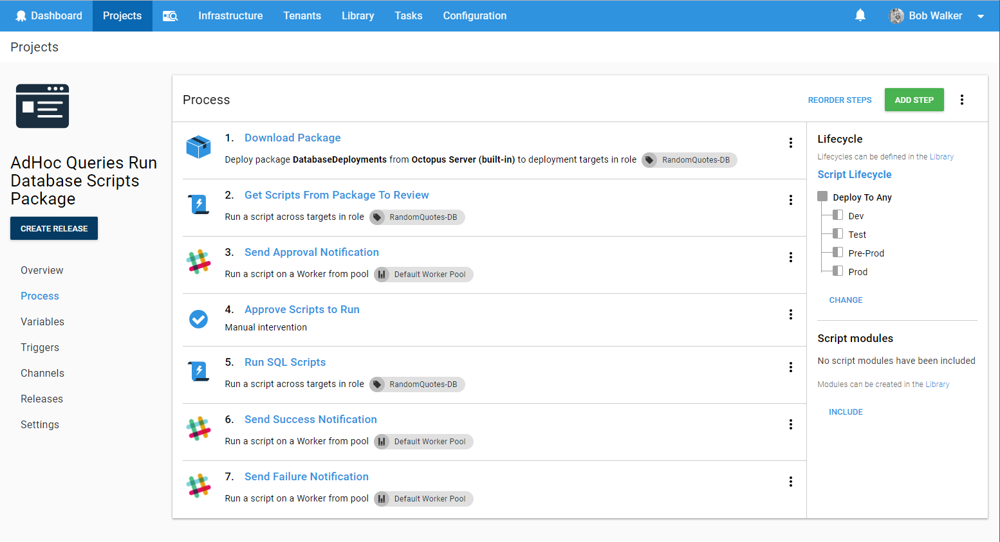

The download package step is very straightforward.  Download the package to the server.  Don't run any configuration transforms.  Don't replace any variables.  Just deploy the package.

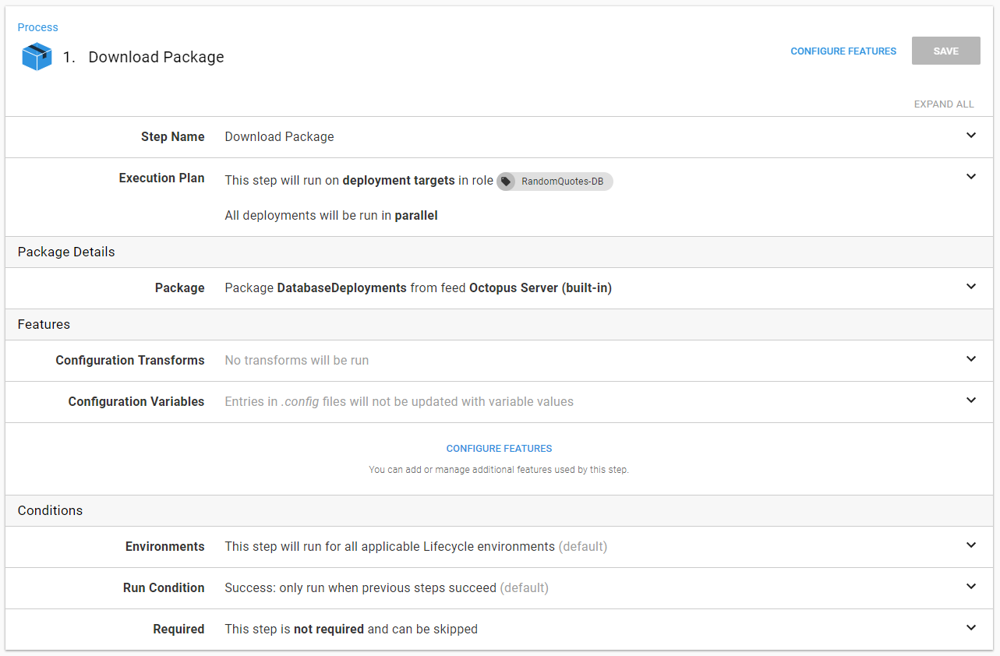

The Get Scripts From Package to Review is a step template.  It will do the following:

1) Read the YAML file and set output parameters
2) Add all the files in the package as artifacts
3) Perform some basic analysis on the SQL files
4) Set an output variable, ManualInterventionRequired, in the event the analysis fails

This is all down in the step template [Get SQL Scripts For Review](source/step-templates/GetSqlScriptsForReview.json).  The only parameter required is the step which downloaded the package.

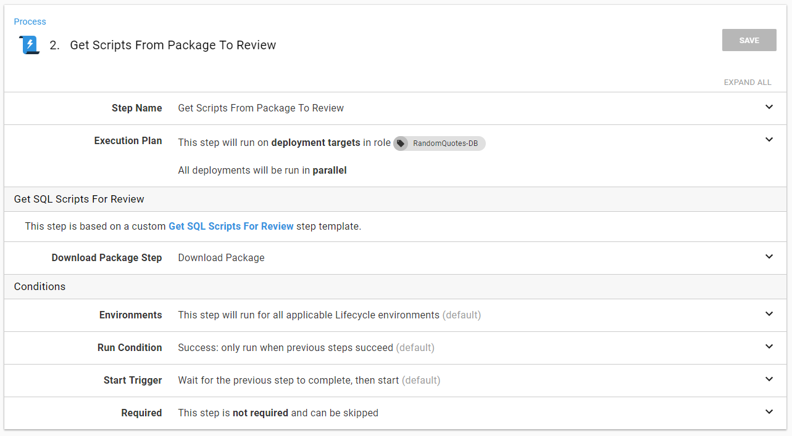

The format for output parameters with Octopus Deploy is...a little tricky to remember.  I know I would mistype something.  Rather than do that I used variables.  This way if I do change something I only have to change it one place.


Now when I notify someone I can include that information very easily.  Also, make note that this step will run based on the ManualInterventionRequired output variable.

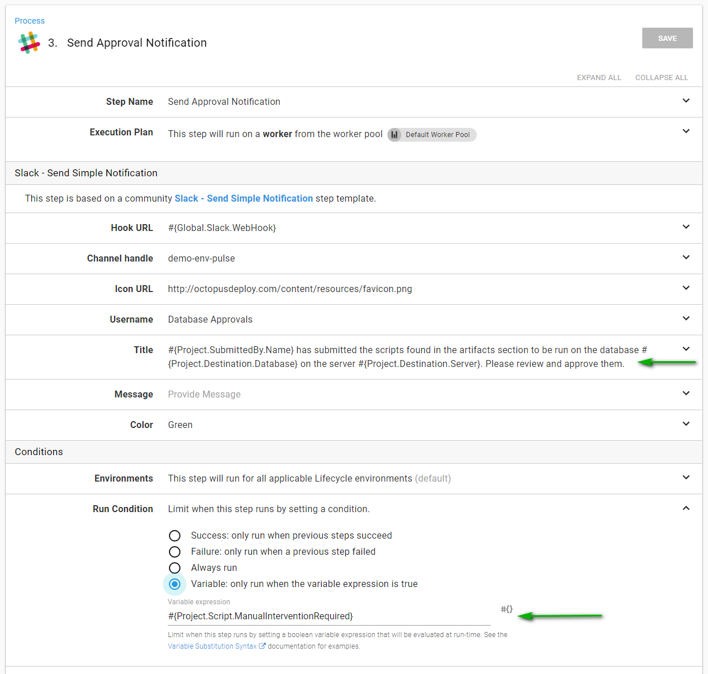

The same is true for the manual intervention.  The run condition is based on the ManualInterventionRequired output variable.

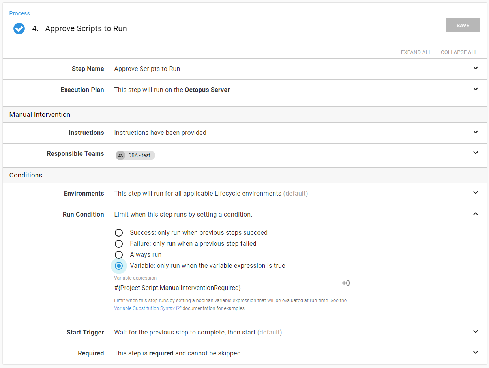

The Run SQL Scripts step will go through all the SQL files and run them.  Again, to make it easier I used a step template.  This process used invoke-sqlcmd.  The nice thing about that is it will capture the output and add task history.

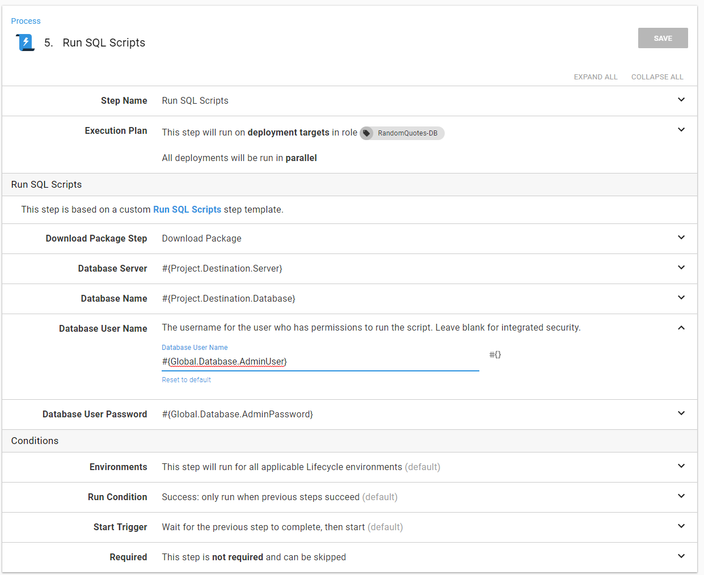

Assuming everything went well the success notification can go out.

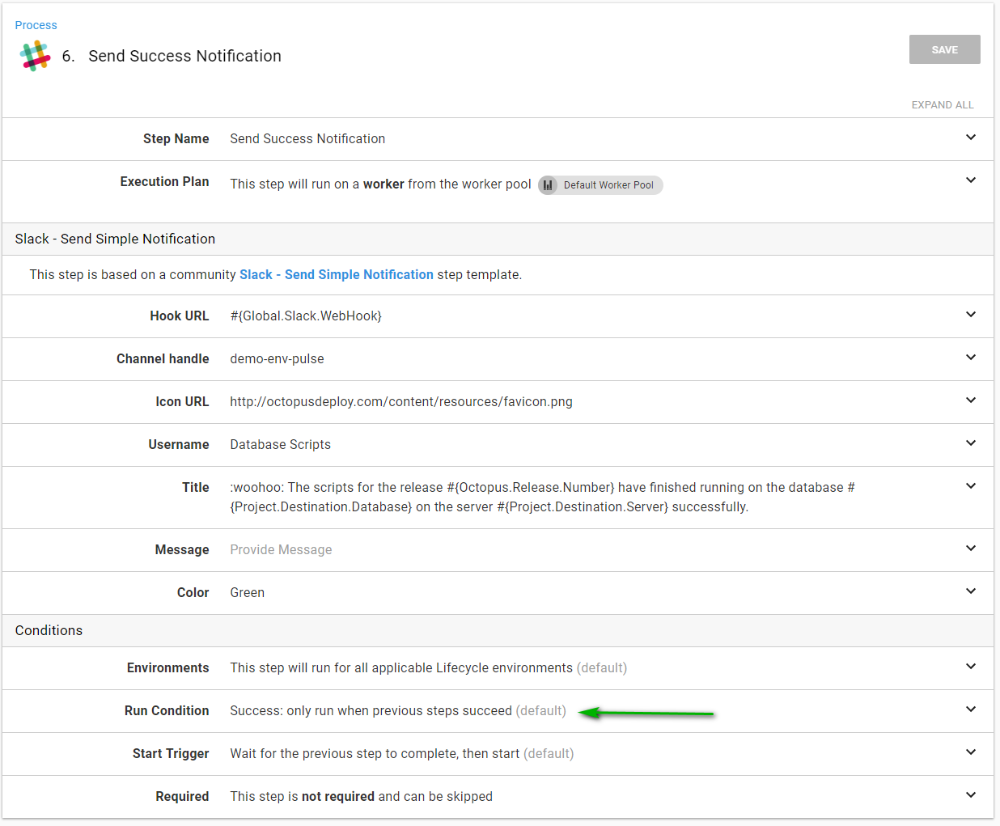

Otherwise, the failure notification can go out.

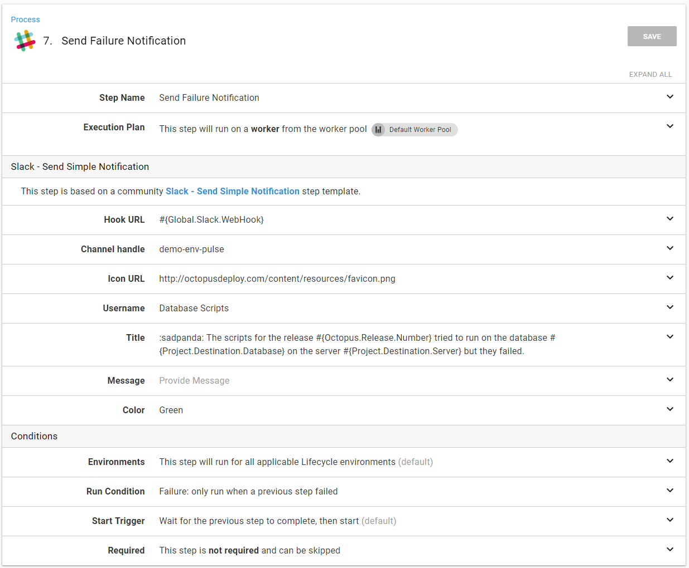


